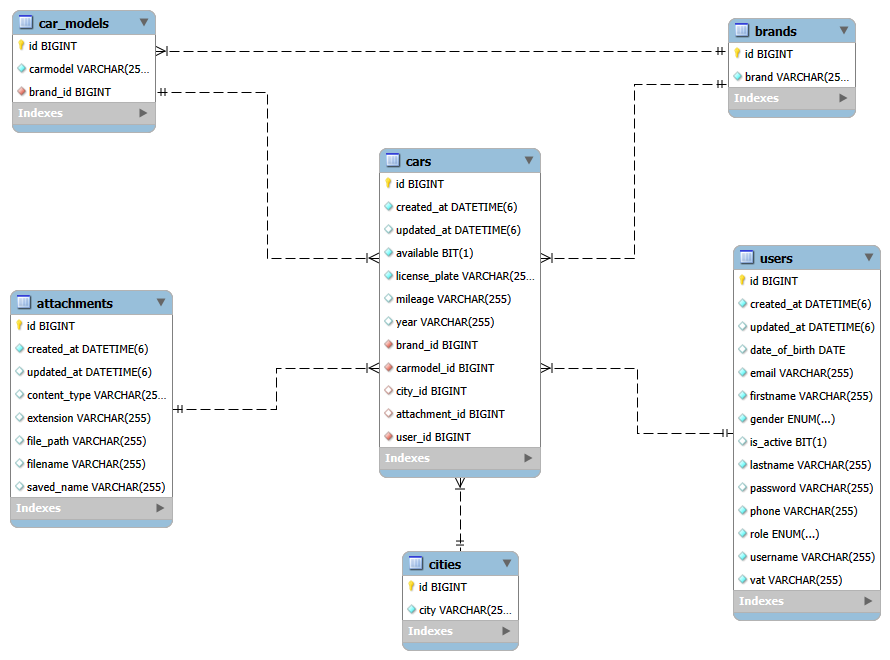

# 🚗 Car Rental App - Backend
## A [Coding Factory](https://codingfactory.aueb.gr/) @ [AUEB](https://www.aueb.gr/) Final Project. Java - Spring Boot - Rest - Car Rental Application backend.
## 📝 Overview
The Car Rental App backend is a Spring Boot application that provides RESTful APIs 
for managing cars, users, and rental services. It handles operations such as car 
registration, updates, deletions, and user authentication. The backend also manages 
photo uploads for car listings and ensures data integrity through exception handling 
and transactional operations.

## ✨ Features
- Car management (CRUD operations)
- User registration and authentication
- Photo upload and attachment to cars
- Brand, model, car, city and user model management
- Pagination and sorting for car listings
- Validation and exception handling
- Super Admins have enhanced permissions to:
  - Manage brands, car models and cities
  - Toggle user status
  - Change user roles

## 🛠️ Technologies Used
- **Java 17**
- **Spring Boot 3.3.5**
- **Spring Data JPA**
- **Hibernate**
- **Lombok**
- **MySQL** 
- **Gradle**
- **JWT** for authentication
- **MultipartFile** for file uploads

## 📂 Project Structure
```
carrentalapp
├── src
│   ├── main
│   │   ├── java
│   │   │   └── gr.aueb.cf.carrentalapp
│   │   │       ├── authentication      
│   │   │       ├── config              
│   │   │       ├── core                
│   │   │       │   ├── enums           
│   │   │       │   ├── exceptions     
│   │   │       │   ├── filters        
│   │   │       │   └── specifications  
│   │   │       ├── dto                 
│   │   │       ├── mapper              
│   │   │       ├── model              
│   │   │       ├── repository          
│   │   │       ├── rest                
│   │   │       ├── security           
│   │   │       └── service             
│   │   └── resources
│   │       ├── application.properties  
│   │       └── sql                     
│   └── test
│       └── java
│           └── gr.aueb.cf.carrentalapp 
└── build.gradle                        

```

## Database Schema



# ⚙️ Installation and Setup

## Prerequisites
- Java 17 or later
- Gradle 8x+
- MySQL (or compatible database)
- IntelliJ IDEA or any suitable Java IDE

## Clone the Repository
```bash
git clone https://github.com/PetrosZark/CarRentalApp-Java_Backend.git
```

## Open the Project in your Java IDE

## Database Initialization (First-Time Setup)
1. Create Database Schema:
   - In your MySQL database, manually create a schema named carrentaldb.
2. Run the Application (First Run):
   - Start the application to allow Spring Boot and Hibernate to auto-generate 
   the necessary tables: 
    ```bash
    ./gradlew bootRun
    ```
   - This step ensures the schema is populated with the required tables, but without initial data.
3. Enable SQL Data Seeding (Second Run):
   - Open src/main/resources/application-dev.properties and uncomment the following 
   lines to seed the initial data:
    ```bash
    spring.sql.init.mode=always
    spring.sql.init.data-locations=classpath:sql/brands.sql, classpath:sql/carmodels.sql, classpath:sql/cities.sql, classpath:sql/user.sql
    ```
4. Run the Application Again:
   - Start the application to load brand, car model, city, and user 
   data into the database:
    ```bash
    ./gradlew bootRun
    ```
5. Disable SQL Initialization (After Seeding):
   - Comment out the initialization lines after verifying the data to avoid 
   re-running the scripts on every restart:
   ```bash
    # spring.sql.init.mode=always
    # spring.sql.init.data-locations=classpath:sql/brands.sql, classpath:sql/carmodels.sql, classpath:sql/cities.sql, classpath:sql/user.sql
    ```
## 🏗️ Build and Run
```bash
./gradlew clean build
./gradlew bootRun
```

## 🚀 Usage
Once the server is up and running, you can interact with the REST API endpoints 
using tools like Postman or integrate directly with the 
[Angular frontend](https://github.com/PetrosZark/CarRentalApp-Angular_Frontend), 
which is built to complement this backend.

## 🛣️ API Endpoints

### 🔑 User Authorization and Registering
- **POST /api/authenticate** – Login user
- **POST /api/register** – Register user

### 🏠 Garage Endpoints
- **GET /api/home/garage** – Get paginated list of your cars
- **GET /api/home/garage/{carId}** – Get car by id
- **POST /api/home/garage** – Add a new car
- **POST /api/home/garage/{carId}/upload-image** – Upload car image
- **PUT /api/home/garage/update/{carId}** – Update car details
- **DELETE /api/home/garage/delete/{carId}** – Delete a car
- **DELETE /api/home/garage/{carId}/delete-image** – Delete car image

### 🚙 Search Cars Endpoints
- **GET /api/home/cars** – Get paginated list of other users' cars
- **GET /api/home/brands** – Get list of all brands
- **GET /api/home/models** – Get list of all models
- **GET /api/home/cities** – Get list of all cities

### 🛡️ Entities Endpoints (SUPER_ADMIN authorized only)
- **GET /api/home/manage-entities/users** – Get paginated list of users
- **PATCH /api/home/manage-entities/users/{username}/toggle-status** – Toggle user status
- **PATCH /api/home/manage-entities/users/{username}/change-role** – Change user role
- **DELETE /api/home/manage-entities/users/{username}** – Delete user
- **POST /api/home/manage-entities/brands** – Add new brand
- **POST /api/home/manage-entities/carmodels** – Add new model
- **POST /api/home/manage-entities/cities** – Add new city

# 🚀 Deployment
Deploying the Car Rental App backend can be done through multiple approaches.
You can containerize and deploy the Car Rental App backend using Docker for a consistent 
and portable deployment environment.

## 🐳 Docker Deployment
   Docker allows you to containerize the application for easy deployment across environments.

### 1. Create Dockerfile
In the root directory, create a file named Dockerfile with the following content:
```bash
# Use an official Java runtime as base image
FROM eclipse-temurin:17-jdk

# Set work directory in container
WORKDIR /app

# Copy the build jar to the container
COPY build/libs/car-rental-0.0.1-SNAPSHOT.jar app.jar

# Expose port 8080
EXPOSE 8080

# Run the Spring Boot app
ENTRYPOINT ["java", "-jar", "/app.jar"]
```

### 2. Change Spring Profile
In application.properties change spring.profiles.active=dev to 
spring.profiles.active=prod

### 3. Build the Docker Image. 
   Run the following command to build the Docker image:
```bash
./gradlew build
docker build -t carrental-backend .
```
### 4. Run the Docker Container
   Deploy the container with the following command:
```bash
docker run -p 8080:8080 carrental-backend
```
The application will now be accessible at:
http://localhost:8080

## 📧 Contact
For questions or feedback, feel free to reach out:
- **Name**: Zarkadis Petros
- **Email**: petros.zark@hotmail.com

---

## 🔐 Example Credentials
- Admin User:
  - username: SuperAdmin
  - password: Sa123456!

